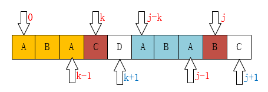

# KMP

KMP是三位大牛：D.E.Knuth、J.H.Morris和V.R.Pratt同时发现的

KMP算法要解决的问题就是在字符串（也叫主串）中的模式（pattern）定位问题。说简单点就是我们平时常说的关键字搜索。模式串就是关键字（接下来称它为P），如果它在一个主串（接下来称为T）中出现，就返回它的具体位置，否则返回-1（常用手段）。

## 发现规律


上图C和D不匹配，我们要把j移动到哪？显然是第1位。为什么？因为前面有一个A相同啊：


如下图也是一样的情况：


可以把j指针移动到第2位，因为前面有两个字母是一样的：


至此我们可以大概看出一点端倪，当匹配失败时，j要移动的下一个位置k。存在着这样的性质：最前面的k个字符和j之前的最后k个字符是一样的。

$$
P[0:k-1] == P[j-k:j-1]
$$

这个相当重要，如果觉得不好记的话，可以通过下图来理解：


弄明白了这个就应该可能明白为什么可以直接将j移动到k位置了。

因为：当$T[i] \ne P[j]$时，有$T[i-j:i-1]=P[0:j-1]$，由$P[0:~k-1]=P[j-k~j-1]$，必然有$T[i-k:i-1]=P[0:k-1]$

### 计算跳转的k值

假的$next[j]$的值（也就是k）表示，当$P[j] \neq T[i]$时，$j$指针的下一步移动位置。

当$j$为0时，如果这时候不匹配，怎么办？


像上图这种情况，j已经在最左边了，不可能再移动了，这时候要应该是i指针后移。所以在代码中才会有`next[0] = -1;`这个初始化。

如果是当j为1的时候呢？


显然，j指针一定是后移到0位置的。因为它前面也就只有这一个位置

下面这个是最重要的，请看如下图：


规律：

$$
\text{当}P[k]==P[j]\text{时，}\\
\text{有}next[j+1]==next[j] + 1
$$

其实这个是可以证明的：

因为在$P[j]$之前已经有$P[0 ~ k-1] == p[j-k ~ j-1]$。（$next[j] == k$）
这时候现有$P[k] == P[j]$，我们是不是可以得到$P[0 ~ k-1] + P[k] == p[j-k ~ j-1] + P[j]$。

即：P[0 ~ k] == P[j-k ~ j]，即next[j+1] == k + 1 == next[j] + 1。

这里的公式不是很好懂，还是看图会容易理解些。

那如果P[k] != P[j]呢？比如下图所示：



像这种情况，如果你从代码上看应该是这一句：k = next[k];为什么是这样子？你看下面应该就明白了。


现在你应该知道为什么要k = next[k]了吧！像上边的例子，我们已经不可能找到[ A，B，A，B ]这个最长的后缀串了，但我们还是可能找到[ A，B ]、[ B ]这样的前缀串的。所以这个过程像不像在定位[ A，B，A，C ]这个串，当C和主串不一样了（也就是k位置不一样了），那当然是把指针移动到next[k]啦。

## go参考代码

```go
func getNext(p string) []int {
    next := make([]int, len(p))

	// 第一个匹配失败时，源字符串向后一动一维
	next[0] = -1

	j := 0
	k := -1

	for j < len(p)-1 {
		if k == -1 || p[j] == p[k] {
			k++
			j++
			next[j] = k
		} else {
			k = next[k]
		}
	}
	return next
}
```

## 例子

[28. Implement strStr()](https://leetcode.com/problems/implement-strstr/)

## 参考
[KMP算法](https://www.cnblogs.com/yjiyjige/p/3263858.html)