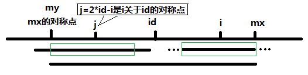

# Manacher's Algorithm

用来查找一个字符串的最长回文子串的线性方法

## Complexity

Time Complexity:  $O(n)$

## 算法步骤

由于回文长度可奇可偶，第一步骤就是在字符的左右两边添加特殊字符，例如 **\#**

$$
\text{bob} \Rightarrow \text{b\#o\#b} \\
\text{noon} \Rightarrow \text{n\#o\#o\#n}
$$

这样的好处是不管字符串是奇数个还是偶数个，处理后的字符串的个数都是奇数个。处理时可不需要分情况处理了，可以使用同一个方法处理。

接下来，处理与处理后字符串等长的数组$p$，其中$p[i]$表示以$t[i]$字符为中心的回文字符串的半径。例如$p[i]=1$, 表示以$t[i]$为中心的回文长度就是1，只有$t[i]$一个字符。

看个例子：
```txt
$ # 1 # 2 # 2 # 1 # 2 # 2 # 
$ 1 2 1 2 5 2 1 6 1 2 3 2 1
```

...

计算原文$t[i]$回文长度l:
$$
l = p[i] - 1
$$

计算$t[i]$回文长度起始位置：
$$
s = \frac{i -p[i]}{2}
$$

$p[i]$计算公式，
$$
p[i] =
\begin{cases}
min(p[2*id-i], mx - i), &\text{if }mx>i\\
1, & \text{if } mx \le i

\end{cases}
$$
其中$id$为能延伸到最右端的位置的那个回文子串的中心点位置，$mx$是回文串能够延伸到最右端的位置

当 $mx - i > P[j]$ 的时候，以S[j]为中心的回文子串包含在以$S[id]$为中心的回文子串中，由于$i$和$j$对称，以$S[i]$为中心的回文子串必然包含在以$S[id]$为中心的回文子串中，所以必有$P[i] = P[j]$，其中 $j = 2*id - i$，因为 $j$ 到 $id$ 之间到距离等于 $id$ 到 $i$ 之间到距离，为 $i - id$，所以 $j = id - (i - id) = 2*id - i$，参见下图;


当 $P[j] >= mx - i$ 的时候，以$S[j]$为中心的回文子串不一定完全包含于以$S[id]$为中心的回文子串中，但是基于对称性可知，下图中两个绿框所包围的部分是相同的，也就是说以$S[i]$为中心的回文子串，其向右至少会扩张到$mx$的位置，也就是说 $P[i] = mx - i$。至于$mx$之后的部分是否对称，就只能老老实实去匹配了，这就是后面紧跟到while循环的作用。



对于 $mx <= i$ 的情况，无法对$P[i]$做更多的假设，只能$P[i] = 1$，然后再去匹配了。


## 题目

[Longest Palindromic Substring](https://leetcode.com/problems/longest-palindromic-substring/submissions/)