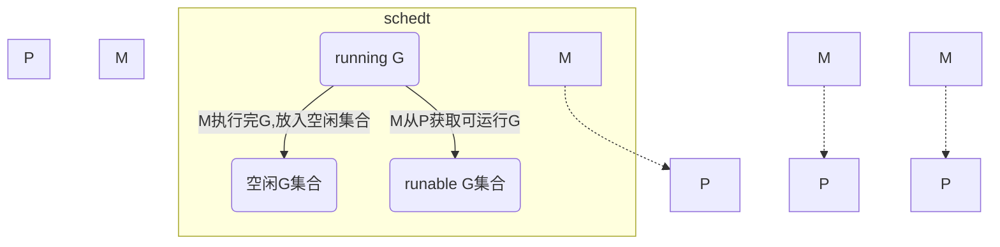

#go
 
- `G`: goroutine
- `M`: 工作线程，即内核线程
- `P`: 调度器
 
`M`必须关联一个`P` 才能执行`G`。但是`M`是可以被阻塞或者陷入一个syscall w/o



```go
// src/runtime/runtime2.go
type g struct {
	stack stack // offset known to runtime/cgo
	m *m // current m; offset known to arm liblink
	sched gobuf
    goid int64

	schedlink guintptr
	preempt bool // preemption signal, duplicates stackguard0 = stackpreempt
	...
	gopc uintptr // pc of go statement that created this goroutine
	startpc uintptr // pc of goroutine function
}
```

```go
// src/runtime2.go
type m struct {
	g0 *g // goroutine with scheduling stack
	...
	curg *g // current running goroutine
	...
    p puintptr // attached p for executing go code (nil if not executing go code)
	nextp puintptr
	...
	id int64
	...
	spinning bool // m is out of work and is actively looking for work
	...
	park note
	alllink *m // on allm
	schedlink muintptr
}
```
```go
// src/runtime/runtime2.go
type p struct {
	id int32
	status uint32 // one of pidle/prunning/...
	...
	m muintptr // back-link to associated m (nil if idle)
}
```

```go
// src/runtime2.go
type shedt struct {
	
}
```

G的状态
- Gidle: 被创建当没有执行初始化
- Grunnable: 可运行
- Grunning: 正在运行中
- Gsyscall: 正在执行系统调用
- Gwaiting: 正在等待
- Gdead: 运行完成

P的状态：
- Pidle: 没有关联M
- Prunning: 已经和某个`M`关联
- Psyscall: 当前P中运行的那个G正在进行系统调用
- Pgcstop: 系统正在GC
- Pdead: 当前P不再使用

g0
m0


## Refer
https://golang.org/s/go11sched