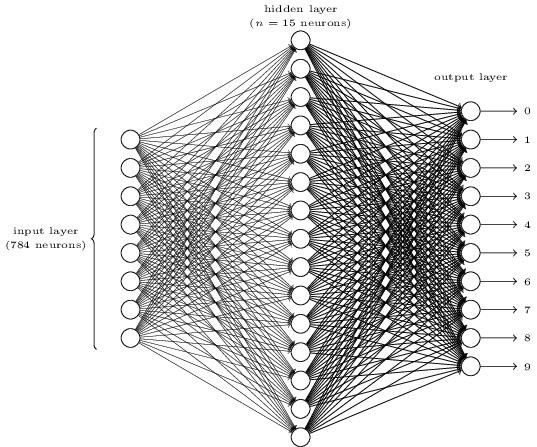

# 学习 Neural Network And Deep Learning 练习


## sigmoid

Sigmoid函数

$$
\sigma(z)=\frac{1}{1+e^{-x}}
$$

python实现代码

```python
def sigmoid(z):
    return 1.0/(1.0 + np.exp(-z))
```

Sigmoid的导数

$$
\begin{aligned}
    {\sigma}'(z)
    & ={(\frac{1}{1+e^{-z}})}'\\
    & =\frac{e^{-z}}{(1+e^{-z})^2}\\
    &=\frac{1+e^{-z}-1}{(1+e^{-z})^2}\\
    &=\frac{1}{1+e^{-z}}(1-\frac{1}{1+e^{-z}})\\
    &=\sigma(z)\cdot(1-\sigma(z))
\end{aligned}
$$

python实现代码
```python
def sigmoid_prime(z):
    return sigmoid(z)*(1-sigmoid(z))
```


目标是将损失最小化

$\Delta C$与$v_1$和$v_2$的关系，
$$
\Delta C \approx \frac{\partial C}{\partial v_1}\Delta v_1+\frac{\partial C}{\partial v_2}\Delta v_2
$$

关于$\nabla C$的偏导记为：
$$
\nabla C \equiv(\frac{\partial C}{\partial v_1}, \frac{\partial C}{\partial v_2})^T
$$

$\Delta C$可以写成
$$
\Delta C \approx \nabla C \cdot \Delta v
$$

为了使得将损失往小的方向推进，取
$$
\Delta v = -\eta \nabla C
$$
即
$$
\Delta C \approx \nabla C \cdot \Delta v = -\eta \|\nabla C\|^2
$$


# 手写识别中使用




隐藏层的第i个神经元的输出
$$
h_i=\sum_j{w_{ij} \cdot x_j} + b_i
$$

偏导式
$$
\frac{\partial h}{\partial w_{ij}} = x_j \\
\frac{\partial h}{\partial b} = 1
$$

写成向量式：
$$
\vec{h}=\vec{x} \cdot W + \vec{b} =
\cdot
\begin{bmatrix}
    x_1 & x_2 & \cdots & x_{784}
\end{bmatrix}
\begin{bmatrix}
    w_{1,1} & w_{1,2} & \cdots & w_{1,30} \\
    w_{2,1} & w_{2,2} & \cdots & w_{2, 30} \\
    \vdots  & \vdots  & \ddots & \vdots  \\
    w_{784,1}& w_{784,2} & \cdots & w_{784, 30} 
\end{bmatrix} +
\begin{bmatrix}
    b_1 & b_2 & \cdots & b_{30}
\end{bmatrix}
$$

输出层的第i个神经元的输出
$$
y_i = \sum_j {w_{ij}\cdot h_j} + b_i \\
o_i = \sigma(\sum_j {w_{ij}\cdot h_j} + b_i)
$$

偏导式
$$
\frac{\partial o_i}{\partial w_{ij}}
=\frac{\partial\sigma(y_i)}{\partial y_i} \cdot \frac{\partial y_i}{w_{ij}}
=\sigma(y_i)(1 - \sigma(y_i))\cdot h_i \\

\frac{\partial o_i}{\partial b_{i}}
=\frac{\partial\sigma(y_i)}{\partial y_i} \cdot \frac{\partial y_i}{b_{i}}
=\sigma(y_i)(1 - \sigma(y_i))
$$


损失函数
$$
C(w, b)=\frac{1}{2n}\sum{\|y(x) - a\|^2} \\
$$

那么$\frac{\nabla C}{\nabla w}$是
$$
\frac{\nabla C}{\nabla w_{ij}} = (\frac{1}{2n} \cdot 2 \cdot\sum{\|y(x) - a\|})\frac{\partial y}{\partial w_{ij}}
$$

## 训练方式

```python
import mnist
import network
import numpy as np

training_data, test_data = mnist.load_data()

net = network.Network([784, 30, 10])
net.SGD(training_data, 30, 10, 3.0, test_data=test_data)
```

## References

- [Neural Networks and Deep Learning](http://neuralnetworksanddeeplearning.com/)
- [THE MNIST DATABASE](http://yann.lecun.com/exdb/mnist/)

